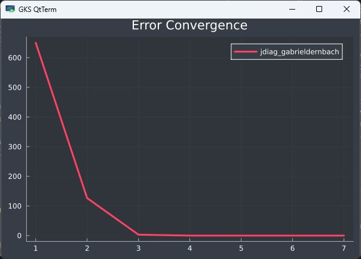
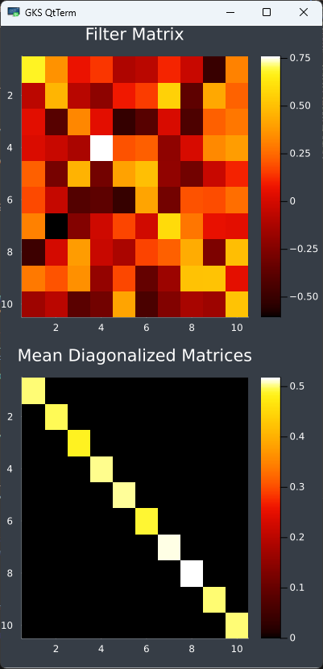

```@meta
CurrentModule = AJD
```

# Getting Started Guide
This guide provides information on the basic usage of the AJD.jl package.

## Installation
To install the Package follow these instructions to add the package to a basic Julia environment or use the package in a Pluto notebook.

### Julia
Create temporary environment in the [Julia REPL](https://docs.julialang.org/en/v1/stdlib/REPL/):
```julia
] activate --temp
```
Add the package:
```julia
] add https://github.com/muehlefeldt/AJD.jl
```

### Pluto
The use in [Pluto notebooks](https://plutojl.org/) is supported. Add the package in one cell of the notebook:
```julia
begin
    using Pkg
    Pkg.activate("MyTestEnv")
    Pkg.add(url="https://github.com/muehlefeldt/AJD.jl")
    using AJD
end
```

## Basic usage
The most basic usage of the package given a vector ``M`` of ``k`` square matrices (``n \times n``):
```julia
using AJD
filter = diagonalize(M)
```

The returned object `filter` of `diagonalize()` is a LinearFilter containing the matrix ``F`` as well as ``F'``. Assuming ``A \in M`` these are used to diagonlize ``A`` by calculating ``D = F' * A * F``. ``D`` being the diagonalized matrix. In Julia you calculate:
```julia
D = filter.iF * A * filter.F
```

## Advanced options
The main function `diagonlaize()` provides several options to be choosen by the user.

### Algorithms
The package allows to choose diffrent algorithms to calculate the AJD.
#### JDiag
Three implementations of JDiag are avalaible:
* The Cardoso implementation is based on [Matlab Code by Cardoso](https://www2.iap.fr/users/cardoso/jointdiag.html). Use the keyword `algorithm="jdiag_cardoso"`.
* Based on a [Python implementation by Gabrieldernbach](https://github.com/gabrieldernbach/approximate_joint_diagonalization/) the second implementation is suitable for matrices consisting of real and complex values. Use the keyword `algorithm="jdiag_gabrieldernbach"`.
* The third implementation of JDiag is based on the [Python code by Edouardpineau](https://github.com/edouardpineau/Time-Series-ICA-with-SOBI-Jacobi) also supports real and complex matrices, as well as hermitian matrices included in the module `PosDefManifold.jl`, which are used in the `Diagonalizations.jl` package too. Use the keyword `algorithm="jdiag_edourdpineau"`.

For example execute:
```julia
# Generate 1000 matrices of 10 x 10 size.
M = AJD.random_normal_commuting_matrices(10, 1000)
# Diagonlize M using selected algorithm.
digonalize(M, algorithm="jdiag_edourdpineau")
```

#### FFDiag
One implementation of the FFDiag algorithm is available through the keyword `algorithm="ffdiag"`.

### Plotting
Visual feedback is available by optional plots of the convergence behaviour and heatmaps of the filter matrix as well as the diagonlized matrices.

#### Plot Convergence
To plot the convergence behaviour use the keyword `plot_convergence=true`. An example output of random matrices can be generated by
```julia
# Generate 1000 matrices of 10 x 10 size.
M = AJD.random_normal_commuting_matrices(10, 1000)
# Diagonalize M.
diagonalize(M, plot_convergence=true)
```
The generate plot:



#### Plot Filter and Diagonalized matrix
To plot the filter matrix and the diagonalized matrices use the keyword `plot_matrix=true`. The diagonalized matrices ``D_k`` are summarised and only ``mean(D_k)`` is plotted to proivde an overview. Execute:
```julia
# Generate 1000 matrices of 10 x 10 size.
M = AJD.random_normal_commuting_matrices(10, 1000)
# Diagonalize M.
diagonalize(M, plot_matrix=true)
```
The generated plot:



### Benchmarking
All implementations of the algorithms can be benchmarked by executing:
```julia
# Using matrices of size 10 x 10. Use 1000 random matrices for each benchmarked run.
ajd_benchmark(10, 1000)
```

Large input sizes require a lot compute time du to repeated execution.

## JDiag Implementations
For the implementation of the AJD in [1] three algorithms are used for comparison.

Another version of the function exists which takes matrices with complex values, which uses the paper found in [1] the aformentioned algorithm and loosely the algorithm [Python Code edouardpineau](https://github.com/edouardpineau/Time-Series-ICA-with-SOBI-Jacobi) (also used for the third implementation).

```julia 
using AJD
using LinearAlgebra

# Generate a vector of matrices with real values as input.
test_input = (1.0) * [Matrix(I, 6, 6) , Matrix(I, 6, 6)]

# Calculate diagonlization of the input matrices.
diagonalize(test_input, algorithm="jdiag_gabrieldernbach")
```

### `AJD.jdiag_edourdpineau`

The third implementation is based on the [Python code by Edouardpineau](https://github.com/edouardpineau/Time-Series-ICA-with-SOBI-Jacobi) and is a bit more versatile since it takes a Vector of AbstractMatrices as an input and works for real and complex matrices, as well as hermitian matrices included in the module `PosDefManifold.jl`, which are used in the `Diagonalizations.jl` package too. (Hermitian Matrices are included due to possible integration of other functions defined in the `Diagonalizations.jl` package)

```julia 
using AJD
using LinearAlgebra

# Generate a vector of matrices with real values as input.
test_input = (1.0) * [Matrix(I, 6, 6) , Matrix(I, 6, 6)]

# Calculate diagonlization of the input matrices.
diagonalize(test_input, algorithm="jdiag_edourdpineau")
```

## Minimal Working Example

A minimal working example for all algorithms is demonstrated below. The function `diagonalize()` is the **only** function exported from the module and supports access to all algorithms described above. If supported, a complex matrix is used as input as well.

```julia
using AJD
using LinearAlgebra

# Generate a vector of matrices with real values as input.
testinput = (1.0) * [Matrix(I, 6, 6) , Matrix(I, 6, 6)]

@info "Jdiag", diagonalize(testinput; algorithm = "jdiag")
@info "jdiag_edourdpineau", diagonalize(testinput; algorithm = "jdiag_edourdpineau")
@info "jdiag_cardoso", diagonalize(testinput; algorithm = "jdiag_cardoso")

testinput_imag = [[ 1.0 0.0 1.0*im; 0.0 2.0 0.0; 1.0*im 0.0 1.0],[ 1.0 0.0 1.0*im; 0.0 2.0 0.0; 1.0*im 0.0 1.0]]

@info "jdiag",diagonalize(testinput_imag; algorithm = "jdiag")
@info "jdiag_edourdpineau",diagonalize(testinput_imag; algorithm = "jdiag_edourdpineau")

```

For generating further testdata of real matrices the following function can be used (though the function might only work for `diagonalize(input; algorithm = "jdiag_edourdpineau")`):

```julia
using LinearAlgebra
function random_normal_commuting_matrices(n::Int, m::Int)
    Q, _ = qr(rand(n,n))
    Q = Matrix(Q)
    return [Q*Diagonal(rand(n))*Q' for _ in 1:m]
end

```

## Limitations and Known issue

Due to the different implementations the `algorithm = "jdiag"` and `algorithm = "jdiag_edourdpineau"` give different results in order of approx. 10^-1. However due to machine precision it is unclear how reliable those values really are.