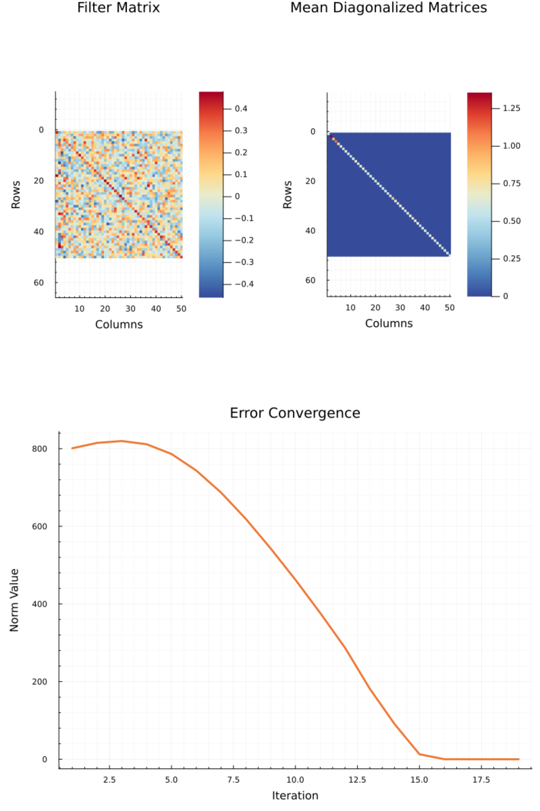

```@meta
CurrentModule = AJD
```

# Getting Started Guide
This guide provides information on the basic usage of the AJD.jl package.

## Installation
To install the Package follow these instructions to add the package to a basic Julia environment or use the package in a Pluto notebook.

### Julia
Create temporary environment in the [Julia REPL](https://docs.julialang.org/en/v1/stdlib/REPL/):
```julia
] activate --temp
```
Add the package:
```julia
] add https://github.com/muehlefeldt/AJD.jl
```

### Pluto
The use in [Pluto notebooks](https://plutojl.org/) is supported. Add the package in one cell of the notebook:
```julia
begin
    using Pkg
    Pkg.activate("MyTestEnv")
    Pkg.add(url="https://github.com/muehlefeldt/AJD.jl")
    using AJD
end
```

## Basic usage
The most basic usage of the package given a vector ``M`` of ``k`` square matrices (``n \times n``):
```julia
using AJD
filter = diagonalize(M)
```

The returned object `filter` of `diagonalize()` is a LinearFilter containing the matrix ``F`` as well as ``F'``. Assuming ``A \in M`` these are used to diagonalize ``A`` by calculating ``D = F' A  F``. ``D`` being the diagonalized matrix. In Julia you calculate:
```julia
D = filter.iF * A * filter.F
```

## Advanced options
The main function `diagonalize()` provides several options to be choosen by the user.

### Algorithms
The package allows to choose different algorithms to calculate the AJD.

#### JDiag
Further reading on the ins and outs of the JDiag algorithm proposed be J.F. Cardoso can be found in reference [[1]](references.md).

Three implementations of the JDiag algorithm are available:
* The Cardoso implementation is based on [Matlab Code by Cardoso](https://www2.iap.fr/users/cardoso/jointdiag.html). Use the keyword `algorithm="jdiag_cardoso"`.
* Based on a [Python implementation by Gabrieldernbach](https://github.com/gabrieldernbach/approximate_joint_diagonalization/) the second implementation is suitable for matrices consisting of real and complex values. Use the keyword `algorithm="jdiag_gabrieldernbach"`.
* The third implementation of JDiag is based on the [Python code by Edouardpineau](https://github.com/edouardpineau/Time-Series-ICA-with-SOBI-Jacobi) also supports real and complex matrices, as well as hermitian matrices included in the module `PosDefManifold.jl`, which are used in the `Diagonalizations.jl` package too. This implementation is currently the standard algorithm for the `diagonalize()` function. Use the keyword `algorithm="jade"`.

For example execute:
```julia
using AJD

# Generate 1000 exactly diagonalizable matrices of 10 x 10 size.
M = AJD.get_test_data(:exact_diag, n_dims=10, n_matrices=1000)

# Diagonalize M using selected algorithm.
diagonalize(M, algorithm="jade")
```

#### FFDiag
One implementation of the FFDiag algorithm is available through the keyword `algorithm="ffdiag"`. Resources to the topic can be found under reference [[2]](references.md).

If you want to use the FFDiag algorithm for calculation of the diagonalization be aware, that a set containing the same matrices or only one matrix can't be calculated using the FFDiag algorithm. NaN values would occur when calculating the update matrix and the algorithm will give back the identity matrix as a filter. If you want to calculate those sets refer to the JDiag implementations.

For a minimal example execute:
```julia
using AJD

# Generate 1000 exactly diagonalizable matrices of 10 x 10 size.
M = AJD.get_test_data(:exact_diag, n_dims=10, n_matrices=1000)

# Diagonalize M using selected algorithm.
diagonalize(M, algorithm="ffdiag")
```

### Plotting
Visual feedback is optionally available. Plots of the convergence behaviour of the used algorithm, heatmaps of the filter matrix as well as the diagonlized matrices can be visualized using the symbol `:plot`.  The diagonalized matrices ``D_k`` are summarised and only ``\overline{D_k}`` is plotted to provide an overview. 

To generate a plot use `diagonalize(M, :plot)`. Example code to generate a plot:

```julia
using AJD
using Plots

# Generate 1000 exactly diagonalizable matrices of 10 x 10 size.
M = AJD.get_test_data(:exact_diag, n_dims=10, n_matrices=1000)

# Diagonalize M and generate plot.
diagonalize(M, :plot)
```
The generated plot:

<p align="left">
  
</p>

### Benchmarking
All implementations of the algorithms can be benchmarked by executing:
```julia
# Using matrices of size 10 x 10. Use 1000 random matrices for each benchmarked run.
ajd_benchmark(10, 1000)
```

Large input sizes require a lot of computation time due to repeated execution.
### Dependency on [Diagonalizations.jl](https://marco-congedo.github.io/Diagonalizations.jl/dev/)
The package works with the [LinearFilter](https://marco-congedo.github.io/Diagonalizations.jl/dev/Diagonalizations/#LinearFilter) object of Diagonalizations.jl for further integration into the Diagonalizations.jl package if so desired. Furthermore, the LinearFilter gives rise to testing of the algorithms with functions like [nonDiagonality](https://marco-congedo.github.io/Diagonalizations.jl/dev/tools/#Diagonalizations.nonDiagonality) provided as part of the package.